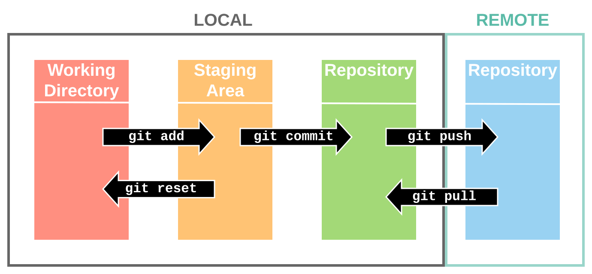

## This is a note about the basic git operations.
>*28.01.2021*, *Zelong Guo*, *@GFZ, Potsdam*

>* fast index
>>	* (1). git basic operations
>>	* (2). 'diff' and 'git diff'

### (1). git basic operations


```bash
# creat git repository, e.g. under linux directiory
git init # or git clone +link
git status
# touch the git.md file
vim git.md
# add the file/changed to the staging area/index
#+++++ git will track the git.md file after git add +++++#
git add .
# if you changed git.mad again with vim, the following command to be used for
# check the modifications
git diff

# setting personal information
git config --global user.name "Zelong Guo"
git config --global user.email "zelong.guo@outlook.com"

# commit your modifications
git add .
git commit -m "My first repository" # also you can type <git commit> to open
# a description file with vim

# do not commit git.md using .gitignore
vim .gitignore # just type 'git.md' in the .gitignore
git status
git add .
git commit -m "added .gitignore"

#+++++ stop to track the git.md file +++++#
git rm --cached git.md
git add .
git commit -m "removed git.md"

#-----------------------------------------------------------------------------------#
## setting git branch 'vim'
git branch vim
git checkout vim  # switch to branch vim
 
# edit and upload my .vimrc
vim ~/.vim/vimrc
git add .
git status
git commit -m "My vimrc"

# switch to my master branch
git checkout master  # Note: then you'll see there is no vimrc files under
# the current dir (linux)

## merge the master and vim branches
# Now sopposing you are under master branch
git merge vim
# as for conflicts, please google 'git merge to'

# even though you merged vim branch to mater branch, the orignal vim branch still remains
# git branch to check this
git branch
# if you'd like to delete the vim branch
git branch -d vim

#-----------------------------------------------------------------------------------#
# Now you can upload your repository to github, firstly you need to creat a new repository 
# in github and copy the link as folowing:
git remote add origin https://github.com/ZelongGuo/linux
git push --set-upstream origin master

# then the username and passwords will be required, you can set it as following to remember 
# your account and password:
git config credential.helper store
# git push again to remenber your account and password
git push --set-upstream origin master

# pull all of the modifications to the local
git pull

# end here
```

### (2). 'diff' and 'git diff'
