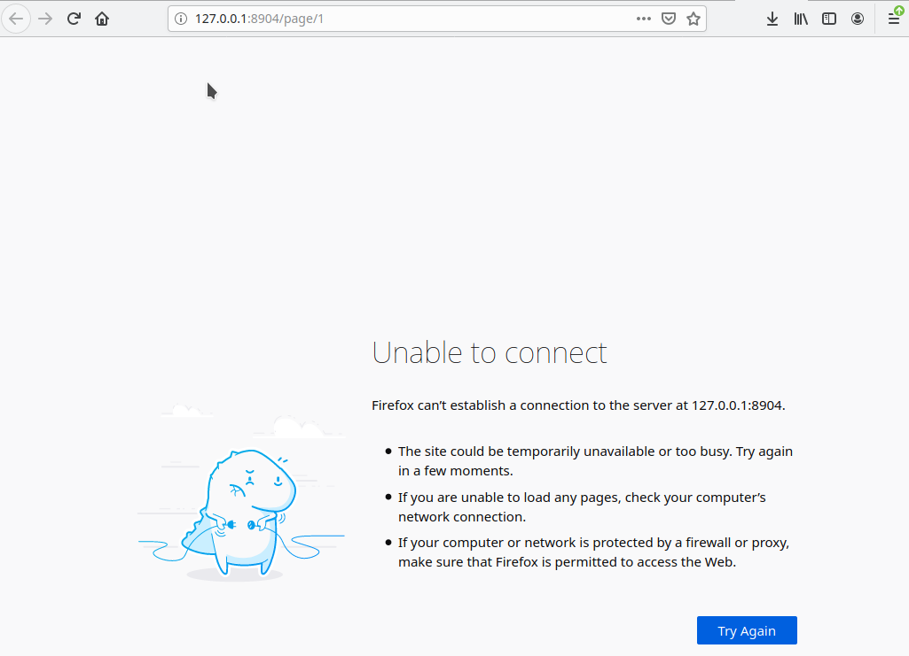

#### Notes about vim + markdown
> 30.01.2021  
@ GFZ, Potsdam

1. `Unable to connect:`
  

You cannot open the preview window if you have logged in another servers, you can **only** open this window **on your local computer**, i.e. mefe9, otherwise, the above error would be threw.
